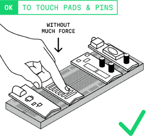
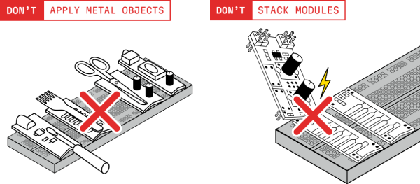
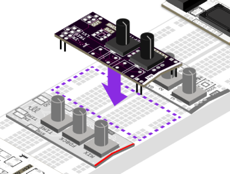
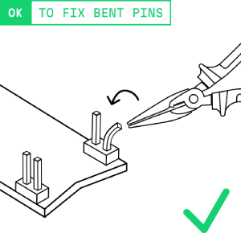
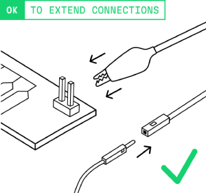

# Safety

MICRORACK is designed to be open but safe and robust platform for hacking and experimentation. Given its bare PCB design it requires a bit more careful handling like other similar devices (e.g. Arduino, Raspberry Pi).

Following a few simple rules and recommendations below will ensure that your modules live a long and happy life.

## Electrical

MICRORACK operates on low voltage (±12V, +5V DC) and it is safe to touch the modules while powered. Some modules are even designed to be touched intentionally. However, there are still some important safety rules to follow.

### Avoid Short Circuits

- It's not recommended to use modules without a breadboard, expose bottom pins and components while powered
- Don't drop or put metal objects (exposed or loose wires, paperclips, etc.) onto the powered breadboard
- Keep liquids away from the breadboard and modules

> ⚠️**Warning:** If you spill water on the device, smell or see smoke, disconnect power immediately!

### Hot-Swapping

While MICRORACK modules are designed to tolerate hot-swapping **the best practice is to power off** your setup before rearranging. **It is okay** to add or remove modules while everything is powered on but requires an extra bit of caution.

For hot-swap **we recommend to turn the volume off** and disconnect the patch wires from the module before you remove it on the fly. Entangled wires can accidentally pull other modules, so it's better to avoid swapping modules while they are patched.

It is also **advisable to avoid** hot-swapping I/O modules while they are directly connected to other sensitive devices (headphones, speakers, recorders, mixers, audio interfaces).

> **Why:** Hot-swapping can cause brief signal spikes and transients while your other equipment might be sensitive to it. We cannot protect your external devices or records from incorrect usage so its recommended to lower the volume, unpatch wires from the swapped module, or even power off the synth first.

### Static Electricity

Like all electronics, modules can be sensitive to static discharge so its recommended to touch a grounded metal object before handling modules (especially in dry environments).

- Store modules in non-conductive container when not in use
- Avoid handling modules on carpet or synthetic surfaces

## Handling

### Pin Headers

The **male pin headers** on the PCBs are robust and durable, but they can sometimes bend. You can notice it if a module or wire does not fit properly. Its easy to just carefully straighten the pins yourself, with pliers or a simple flat screwdriver.

> **Do not use force:** If you feel resistance while inserting cable or module please avoid forced connection or pushing bent pins into the breadboard! Straighten the pins first to avoid any damage.

### Connections

All modules use same standard 0.1" (2.54mm) pitch male headers while cables have female connectors.

We provide compatible wire sets with each kit. These include silicon patch wires, alligator clips and jumpers.

You can use standard Eurorack patch cables, instrument Jacks and MIDI connections as well, just ensure stable module and breadboard mounting, especially with bigger or heavier connectors.

> **Tip:** It's a good practice to reset values of the knobs on the module before patching to avoid unexpected spikes or sounds during performance or recording.  

### Cleaning

**Use plastic brush** to remove dust from the modules. For heavy cleaning, you can apply IPA (Isopropyl Alcohol) to the brush.

**Avoid washing buttons and potentiometers** with IPA. It can cause issues with their contact surfaces.

Avoid using cotton, liquids other than IPA, tools or abrasive materials that could damage or corrode the PCB or components.

### Storage

When not in use, store modules enclosed, in a dry, dust-free environment. While our travel case is in development, we recommend you to store modules in non-conductive containers with foam inserts to protect power pins and the device itself.

---

## Still Unsure?

If you're worried about a specific feature or usage scenario, please don't hesitate to:

- **Post a question at [Forum Support Thread](https://forum.microrack.org/c/support)** — get suggestions and confirmation from experienced users or the team
- **Learn more about [MICRORACK Ecosystem](https://docs.microrack.org/ecosystem)** and how all modules and accessories designed to work together
- **Check the [List of Compatible Modules](https://modules.microrack.org/)** for info on each compatible module and its features
- **Read the [Specification](https://specs.microrack.org/)** for detailed description of power, size and connection standards
