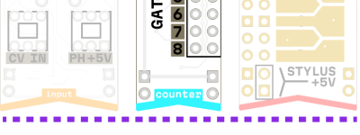

# Safe Usage Guidelines

MICRORACK is designed to be open but safe and robust platform for hacking and experimentation. Following a few simple rules and recommendations below will ensure that your modules live a long and happy life.

## Modules alignment

Every MICRORACK module has a distinct **triangular cutout (notch)** on the PCB. It helps to orientate modules and properly place them on your breadboard with **notch at the bottom**.

> **FYI:** All MICRORACK modules polarities are protected, so if you accidentally plug a module in backwards  — they simply won't work until you align power rails properly.

## Electrical Safety

MICRORACK operates on low voltage (±12V, +5V DC). It is safe to touch the modules while powered. Some modules are even designed to be touched intentionally. However, please follow these guidelines:

### Avoid Short Circuits

- It's not recommended to use modules without a breadboard, expose bottom pins and components while powered
- Don't drop or put metal objects (exposed or loose wires, paperclips, etc.) onto the powered breadboard
- Keep liquids away from the breadboard and modules

> ⚠️**Warning:** If you spill water on the device, smell or see smoke, disconnect power immediately!

### Hot-Swapping

While MICRORACK modules are designed to tolerate hot-swapping **the best practice** is to power off your setup before rearranging.

**It is fine** to carefully insert or remove modules while everything is powered on but requires an extra bit of caution.

Entangled wires can accidentally pull other modules, so **it's better** to avoid swapping modules while they are patched.

For hot-swap **we recommend** to turn the volume off and disconnect the patch wires from the module before you remove it on the fly.

It is also **advisable to avoid** swapping I/O modules while they are directly connected to other sensitive devices (headphones, speakers, microphones, recorders, midi-devices, mixers, audio interfaces).

> **Why:** Hot-swapping can cause brief signal spikes and transients while your other equipment might be sensitive to it. We cannot protect your external devices or records from incorrect usage so its recommended to lower the volume, unpatch or even power off first.

## Handling

### Pin Headers

The **male pin headers** on the PCBs are robust and durable, but they can sometimes bend. You can notice it if a module or wire does not fit properly.

> **Do not use force:** If you feel resistance while inserting cable or module please avoid forced connection or pushing bent pins into the breadboard!

Its easy to just carefully straighten the pins yourself, with pliers or a simple flat screwdriver.

### Connections

All modules use same standard 0.1" (2.54mm) pitch male headers while cables have female connectors.

We provide compatible wire sets with each kit. These include silicon patch wires, alligator clips and jumpers.

You can use standard Eurorack patch cables, instrument Jacks and MIDI connections as well, just ensure stable module and breadboard mounting, especially with bigger or heavier connectors.

> **Tip:** It's a good practice to reset values of the knobs on the module before patching to avoid unexpected spikes or sounds during performance or recording.  

### Static Electricity

Like all electronics, modules can be sensitive to static discharge so its recommended to touch a grounded metal object before handling modules (especially in dry environments).

- Store modules in non-conductive container when not in use
- Avoid handling modules on carpet or synthetic surfaces

### Cleaning

**Use plastic brush** to remove dust from the modules. For heavy cleaning, you can apply IPA (Isopropyl Alcohol) to the brush.

**Avoid washing buttons and potentiometers** with IPA. It can cause issues with their contact surfaces.

Avoid using cotton, liquids other than IPA, tools or abrasive materials that could damage or corrode the PCB or components.

### Storage

When not in use, store modules enclosed, in a dry, dust-free environment. Use anti-static bags, boxes with foam inserts, or plastic containers to protect the device.

## Quick Checklist

Before powering on:

- ☐ All modules inserted with **notch at bottom**
- ☐ Power Module firmly seated in power rails
- ☐ Volume turned down on Output Module
- ☐ No loose wires or metal objects on the breadboard
- ☐ Power supply has correct interface (Type-C or DC Jack), voltage rating (5V-12V) and polarity (Center-Positive)

## Still Unsure?

If you're worried about a specific feature or usage scenario, please don't hesitate to:

- **Post a question:** [Forum Support Thread](https://forum.microrack.org/c/support) — get quick confirmation from experienced users or the team
- **Check the Specs:** [Mechanical Specification](https://specs.microrack.org/) for description of power, size and connection standards
- **Modules List:** [List of Compatible Modules](https://modules.microrack.org/) for info on each compatible module and its features
