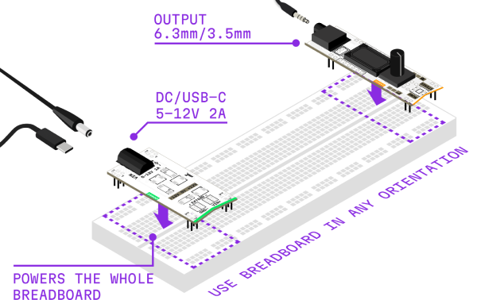

# System Setup

> 5 min read

Welcome to the MICRORACK ecosystem! This guide will help you set up your system and make your first sounds in minutes.

Before you begin, ensure you have:

- Headphones or a speaker with 3.5mm or 6.3mm Jack
- Power Bank, USB Charger or DC-Jack Power Supply
- Breadboard, Power & Output Modules (included in all Kits)

## What's in the Box?

A typical MICRORACK Kit includes:

| | |
|------|-------------|
| **Breadboard** | Your canvas for building and patching (830-point recommended) |
| **Modules** | MICRORACK building blocks ([power](../modules/power/), [oscillator](../modules/oscillator/), [filter](../modules/filter/), [output](../modules/output/), etc.) |
| **Cable Set** | Silicon patch wires, alligator clip, chaining jumpers |

<!-- todo GAP: Confirm exact kit contents for each SKU -->

## Quick Start

Follow the steps below to power up your system and create your first patch.

---

## Powering Up

### Breadboard

A breadboard is the base platform where you will build your MICRORACK system. It distributes power and provides mechanical support for all your modules.

> Compatible full-size 830 tie-point breadboards are included in every MICRORACK Kit and widely available online or at local electronics stores.

MICRORACK modules use only the **Horizontal Power Rails** located on the top and bottom of the breadboard; these rails provide power to all your modules.

For more details on breadboards check out the [Breadboard](../ecosystem/10-breadboard/) page.

### Modules alignment

Every MICRORACK module has a distinct triangular cutout (notch) on the PCB. It helps to orientate modules and properly place them on your breadboard with notch at the bottom.

> **FYI:** All MICRORACK modules polarities are protected, so if you accidentally plug a module in backwards — they simply won't work until you align power rails properly.

### Power Module

The Power Module is the fundamental utility module in MICRORACK System. It converts the power from your source to stable voltages required by modules and expands power connection to other breadboards. [More details](../ecosystem/20-power/)

### Output Module

The Output Module is the main audio output interface for your MICRORACK system. It provides a standard 3.5mm headphone jack and a volume control knob. [More details](../ecosystem/30-output/)

### Connecting the power

1. **Identify the Power Rails:** Most breadboards have two sets of rails on the top and bottom. These will carry the voltages to all your modules.
2. **Insert the Power Module First:** Place the Power Module anywhere on your breadboard. Ensure all pins are firmly seated in the power rails.
3. **Check Orientation:** Ensure the triangular notch is pointing towards you.
4. **Plug your power adapter** into the Power Module.
5. **Check the LEDs:** The Power Module should have indicator LEDs. If they light up, your system is ready!

> **Tip:** One Power Module can power multiple breadboards if they are chained together. See the [Power & Expansion](../ecosystem/20-power/) section for more details.

### Hot-Swapping

While MICRORACK modules are designed to tolerate hot-swapping **the best practice is to power off** your setup before rearranging.

**It is okay** to add or remove modules while everything is powered on but requires an extra bit of caution.

### Quick Checklist

Before powering on:

- ☐ All modules inserted with **notch at bottom**
- ☐ Power Module firmly seated in power rails
- ☐ Volume turned down on Output Module
- ☐ No loose wires or metal objects on the breadboard
- ☐ Power supply has correct interface (Type-C or DC Jack), voltage rating (5V-12V) and polarity (Center-Positive)

### What If Nothing Happens?

- **No LEDs:** Check power supply connection and polarity.
- **Module doesn't work:** Check orientation — notch should be at the bottom.
- **Intermittent power:** Ensure all pins are fully inserted into the breadboard.

---

## First Patch

Let's make some noise! This "Hello World" patch will guide you through the basics of signal flow in MICRORACK.

### Kit 1: The Drone (VCO → Output)

**Goal:** Hear your first sound — a continuous tone.

#### What You Need
- 1× VCO (Voltage Controlled Oscillator)
- 1× Output Module (mod-out-35 or mod-out-63)
- 1× Patch cable (jumper wire)
- Headphones or speakers

#### Instructions

1. **Insert the VCO:** Place your VCO module into the breadboard (notch at bottom)
2. **Insert the Output Module:** Place an Output module nearby
3. **Connect the Signal:**
   - Find the **Red pin** (Output) on the VCO
   - Find the **Blue pin** (Input) on the Output module
   - Connect them with a patch cable
4. **Listen:** Plug in your headphones and turn up the volume

**Result:** You should hear a steady tone. Try turning the **Pitch** knob on the VCO to change the frequency.

> **Tip:** The VCO has multiple outputs (saw, triangle, square). Each has a different timbre — try connecting different ones!

### Kit 2: Subtractive Synthesis (VCO → VCF → Output)

**Goal:** Shape the tone using a filter.

#### What You Need
- Previous setup, plus:
- 1× VCF (Voltage Controlled Filter)

#### Instructions

1. **Insert the VCF:** Place it between the VCO and Output module
2. **Re-route the Patch:**
   - VCO Output (Red) → VCF Input (Blue)
   - VCF Output (Red) → Output Module Input (Blue)
3. **Tweak:** Turn the **Cutoff** knob on the VCF

**Result:** The sound gets brighter (cutoff up) or darker (cutoff down) as you filter out frequencies.

> **Try this:** Turn up the **Resonance** knob for a more aggressive, "singing" filter sound.

### Kit 3: Adding Modulation (LFO → VCF)

**Goal:** Make the filter move automatically.

#### What You Need
- Previous setup, plus:
- 1× LFO (Low Frequency Oscillator) — or use mod-vco in LFO mode

#### Instructions

1. **Insert the LFO:** Place it anywhere on the breadboard
2. **Connect the Modulation:**
   - LFO Output (Red) → VCF CV Input (Blue)
3. **Adjust:** Set the LFO to a slow speed (0.5-2 Hz)

**Result:** The filter cutoff now moves up and down automatically, creating a "wah-wah" or sweeping effect.

> **Experiment:** Try different LFO waveforms (if available) — triangle for smooth sweeps, square for abrupt changes.

### Congratulations!

You've just built your first modular synthesizer patch. From here, the possibilities are endless.

### What's Next?

#### Add More Modules

| Module | What It Does |
|--------|--------------|
| **mod-env** | Add attack/decay/sustain/release shaping |
| **mod-vca** | Control volume with CV |
| **mod-delay** | Add echo and space |
| **mod-seq** | Create melodic sequences |

#### Explore Use Cases

Check out the [Use Cases](../ecosystem/60-use-cases/) section for complete patch ideas:
- Ambient drones
- Guitar effects processing
- Generative music
- MIDI integration

---

### More Resources

- **Learn more:** Explore the [Modules](../modules/) section
- **Get inspired:** Browse the [Forum](https://forum.microrack.org/c/patches)
- **Share:** Post your first patch on [Instagram](https://instagram.com/microrack.synth) with #MICRORACK

---

## Need Help?

<!-- todo: smaller narrower tiles with external link icons -->

If you run into any issues during setup, we're here to help:

|  |  |
|----------|------|
| **Forum Support** | [Create a thread](https://forum.microrack.org/c/support) in the support section |
| **Reddit** | Post on [r/microrack](https://reddit.com/r/microrack) |
| **Instagram** | DM [@microrack.synth](https://instagram.com/microrack.synth) |
| **Telegram** | Join the [channel](https://t.me/microrack) |
| **Email** | Drop a letter to [support@microrack.org](mailto:support@microrack.org) |
| **GitHub** | Follow, [star](https://github.com/microrack) and comment |
